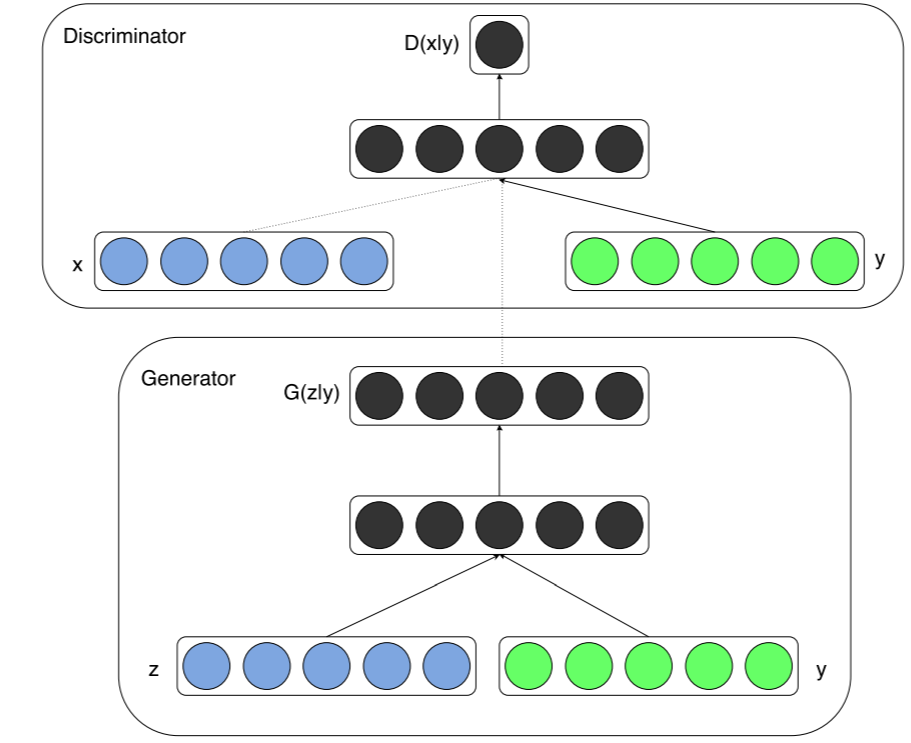
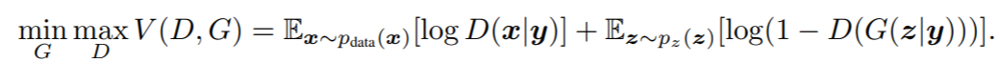
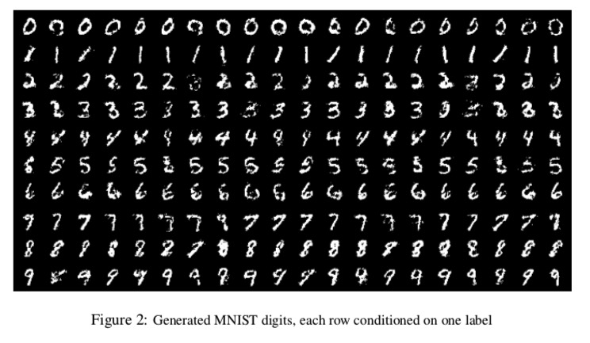

# cGAN

* #### Conditional Generative Adversarial Nets

* #### 등장 배경

  * GAN noise vector를 받아서 output을 생성하는데, 이때 생성되는 output(mode)의 Class를 사람이 제어할 수 없었음. 

  * 본 논문에서는 Condition variable y를 사용해 생성되는 mode를 제어함

    

* #### Conditional Adversarial Nets

  * 기존의 GAN 구조에서 Input에 Auxiliary information y를 추가하여 두 network를 conditionend하게 만듦

  * y는 z나 x에 concat하여 합쳐진 상태로 모델에 주입 (Joint hidden representation)

  * 이때 y는 Label이 될 수도 있고, Image 등의 다른 데이터가 될 수도 있음

    

  * 학습을 진행하며 Condition이 출력에 영향을 끼치게 되고, 최종적으로 출력값이 condition에 종속됨

  * 학습이 완료된 Generator에 종속성을 가진 Condition을 주입하여 원하는 Class의 output을 생성

    

* #### Value Function

  

  * Vanilla GAN과 거의 동일하지만 input data x, y에 condition y가 조건부 확률로 추가됨

* #### Experiment

  * MNIST를 대상으로 실험

    

  * one-hot vector로 encoding된 class label을 y로 사용하여 실험한 결과, 입력한 조건대로 이미지가 잘 생성됨을 확인
